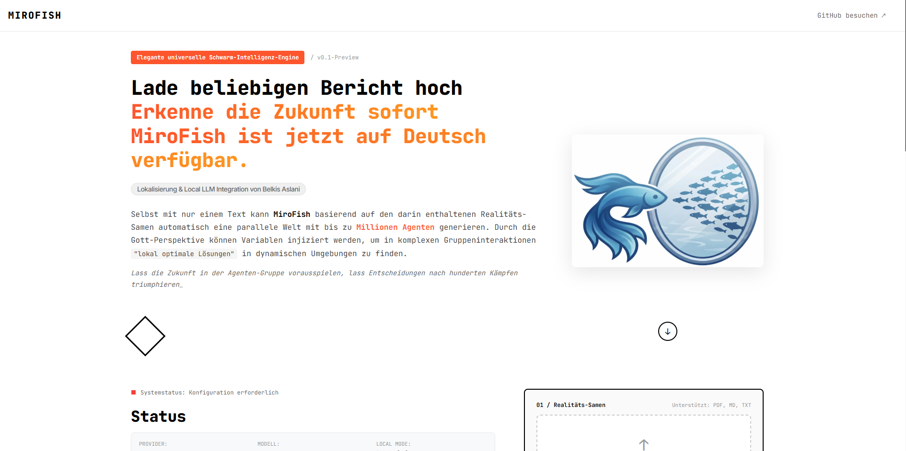
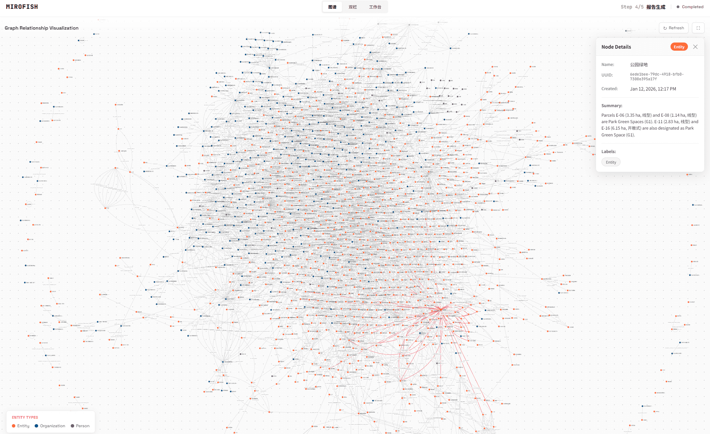

<div align="center">


<a href="https://trendshift.io/repositories/16144" target="_blank"></a>

Elegante universelle Schwarm-Intelligenz-Engine – Alles vorhersagen
</br>
<em>A Simple and Universal Swarm Intelligence Engine, Predicting Anything</em>

## 🚀 Neuigkeiten & Aktuelle Updates (April 2026)

MiroFish wurde massiv erweitert, um flexibler und benutzerfreundlicher zu sein:

*   **🇩🇪 Vollständige deutsche Lokalisierung:** Die gesamte Benutzeroberfläche und Dokumentation ist jetzt auf Deutsch verfügbar.
*   **🏠 Lokale LLM-Unterstützung (LM Studio & Ollama):** MiroFish unterstützt jetzt lokale LLM-Provider. Nutze deine eigenen Modelle (z.B. Llama 3, Qwen, WhiteRabbitNeo) privat und ohne API-Kosten.
*   **🧠 DeepSeek & Reasoning Support:** Optimiertes Parsing für Modelle mit `<think>`-Tags, was eine saubere Verarbeitung komplexer Denkprozesse ermöglicht.
*   **⚙️ Dynamische Konfiguration:** LLM-Provider und API-Einstellungen können nun direkt über das Web-Dashboard geändert und getestet werden.
*   **🛠️ Systemstabilität:** Vollständige Validierung der Workflow-Kette (Ontologie -> Graph -> Profile -> Simulation) für maximale Zuverlässigkeit.

---

[](https://github.com/BEKO2210/MiroFish-DE/stargazers)
[](https://github.com/BEKO2210/MiroFish-DE/watchers)
[](https://github.com/BEKO2210/MiroFish-DE/network)
[](https://hub.docker.com/)

[English](./README-EN.md) | [Deutsch](./README.md)

</div>

## ⚡ Projektübersicht

**MiroFish** ist eine neue Generation von KI-Vorhersage-Engines basierend auf Multi-Agent-Technologie. Durch die Extraktion von Realwelt-Daten (wie Breaking News, Richtlinienentwürfe, Finanzsignale) wird automatisch eine detailgetreue parallele digitale Welt erstellt. In diesem Raum interagieren und entwickeln sich Tausende von Agenten mit unabhängigen Persönlichkeiten, Langzeitgedächtnis und Verhaltenslogik frei. Über die "Gott-Perspektive" können dynamisch Variablen injiziert werden, um zukünftige Entwicklungen präzise zu antizipieren – **Lass die Zukunft im digitalen Sandkasten vorausspielen, lass Entscheidungen nach hunderten Simulationen triumphieren**.

> Du musst nur: Ausgangsmaterial hochladen (Datenanalyseberichte oder interessante Geschichten) und den Vorhersagebedarf in natürlicher Sprache beschreiben</br>
> MiroFish liefert: Einen detaillierten Vorhersagebericht sowie eine interaktive, realitätsnahe digitale Welt

### Unsere Vision

MiroFish strebt danach, einen Spiegel der Schwarm-Intelligenz zu schaffen, der die Realität abbildet. Durch die Erfassung des kollektiven Emergenz-Verhaltens, das durch individuelle Interaktionen entsteht, überwinden wir die Grenzen traditioneller Vorhersagen:

- **Makro**: Wir sind das Labor für Entscheidungsträger, wo Politik und PR risikofrei getestet werden können
- **Mikro**: Wir sind der kreative Sandkasten für individuelle Nutzer, sei es zur Vorhersage von Roman-Enden oder zum Erkunden von Ideen – alles ist interessant, unterhaltsam und greifbar

Von seriöser Vorhersage bis hin zu unterhaltsamer Simulation – wir machen jedes "Was wäre wenn" sichtbar und ermöglichen die Vorhersage von allem.

## 🌐 Live-Demo

Besuche die Online-Demo-Umgebung und erlebe eine Simulation zu einem aktuellen öffentlichen Thema: [mirofish-live-demo](https://666ghj.github.io/mirofish-demo/)

## 📸 Screenshots

<div align="center">
<table>
<tr>
<td></td>
<td></td>
</tr>
<tr>
<td></td>
<td></td>
</tr>
<tr>
<td></td>
<td></td>
</tr>
</table>
</div>

## 🔄 Workflow

1. **Graphen-Aufbau**: Realwelt-Daten-Extraktion & Individuen-/Gruppen-Gedächtnis-Injektion & GraphRAG-Aufbau
2. **Umgebungsaufbau**: Entitätsbeziehungs-Extraktion & Charakter-Generierung & Umgebungskonfiguration
3. **Simulation starten**: Duale Plattform-Parallel-Simulation & automatische Vorhersagebedarfsanalyse & dynamische Zeitreihen-Gedächtnis-Aktualisierung
4. **Berichtsgenerierung**: ReportAgent mit reichhaltigem Toolset für tiefe Interaktion mit der simulierten Umgebung
5. **Tiefe Interaktion**: Gespräch mit beliebiger Person in der simulierten Welt & Dialog mit dem ReportAgent

## 🚀 Schnellstart

### Option 1: Quellcode-Deployment (empfohlen)

#### Voraussetzungen

| Tool | Version | Beschreibung | Prüfung |
|------|---------|--------------|---------|
| **Node.js** | 18+ | Frontend-Laufzeitumgebung, enthält npm | `node -v` |
| **Python** | ≥3.11, ≤3.12 | Backend-Laufzeitumgebung | `python --version` |
| **uv** | Aktuell | Python-Paketmanager | `uv --version` |

#### 1. Umgebungsvariablen konfigurieren

```bash
# Beispielkonfiguration kopieren
cp .env.example .env

# .env Datei bearbeiten und API-Schlüssel eintragen
```

**Erforderliche Umgebungsvariablen:**

```env
# LLM API-Konfiguration (unterstützt beliebige OpenAI SDK-kompatible APIs)
# Empfohlen: Ali Bailian Platform qwen-plus Modell: https://bailian.console.aliyun.com/
# Hinweis: Verbrauch kann hoch sein, zunächst Simulationen mit weniger als 40 Runden empfohlen
LLM_API_KEY=your_api_key
LLM_BASE_URL=https://dashscope.aliyuncs.com/compatible-mode/v1
LLM_MODEL_NAME=qwen-plus

# Zep Cloud Konfiguration
# Kostenloses Kontingent pro Monat für einfache Nutzung: https://app.getzep.com/
ZEP_API_KEY=your_zep_api_key
```

#### 2. Abhängigkeiten installieren

```bash
# Alle Abhängigkeiten mit einem Befehl installieren (Root + Frontend + Backend)
npm run setup:all
```

Oder schrittweise:

```bash
# Node-Abhängigkeiten installieren (Root + Frontend)
npm run setup

# Python-Abhängigkeiten installieren (Backend, erstellt automatisch virtuelle Umgebung)
npm run setup:backend
```

#### 3. Dienste starten

```bash
# Frontend und Backend gleichzeitig starten (im Projekt-Root ausführen)
npm run dev
```

**Dienst-Adressen:**
- Frontend: `http://localhost:3000`
- Backend API: `http://localhost:5001`

**Separater Start:**

```bash
npm run backend   # Nur Backend starten
npm run frontend  # Nur Frontend starten
```

### Option 2: Docker-Deployment

```bash
# 1. Umgebungsvariablen konfigurieren (wie bei Quellcode-Deployment)
cp .env.example .env

# 2. Image pullen und starten
docker compose up -d
```

Standardmäßig wird die `.env` im Root-Verzeichnis gelesen und die Ports `3000 (Frontend)` / `5001 (Backend)` gemappt.

> In `docker-compose.yml` sind beschleunigte Mirror-Adressen als Kommentare hinterlegt, die bei Bedarf ersetzt werden können.

## 📄 Danksagung

MiroFish wird angetrieben von **[OASIS](https://github.com/camel-ai/oasis)**. Wir danken dem CAMEL-AI-Team für ihren Open-Source-Beitrag!

## 📝 Hinweis zu diesem Repository

Dieses Repository ist eine **deutsche Übersetzung** des Originalprojekts [MiroFish von 666ghj](https://github.com/666ghj/MiroFish), um es dem deutschsprachigen Raum zugänglich zu machen. Das Originalprojekt steht unter der [AGPL-3.0 Lizenz](./LICENSE), die Modifikationen und Weiterverbreitung unter derselben Lizenz ausdrücklich erlaubt.

Diese Übersetzung wird aktiv weiterentwickelt und gepflegt. Beiträge und Verbesserungsvorschläge sind jederzeit willkommen!

> **Original**: [https://github.com/666ghj/MiroFish](https://github.com/666ghj/MiroFish)
> **Lizenz**: AGPL-3.0 (identisch zum Originalprojekt)

## 📈 Projektstatistik

<a href="https://www.star-history.com/#BEKO2210/MiroFish-DE&type=date&legend=top-left">
 <picture>
   <source media="(prefers-color-scheme: dark)" srcset="https://api.star-history.com/svg?repos=BEKO2210/MiroFish-DE&type=date&theme=dark&legend=top-left" />
   <source media="(prefers-color-scheme: light)" srcset="https://api.star-history.com/svg?repos=BEKO2210/MiroFish-DE&type=date&legend=top-left" />
   
 </picture>
</a>
